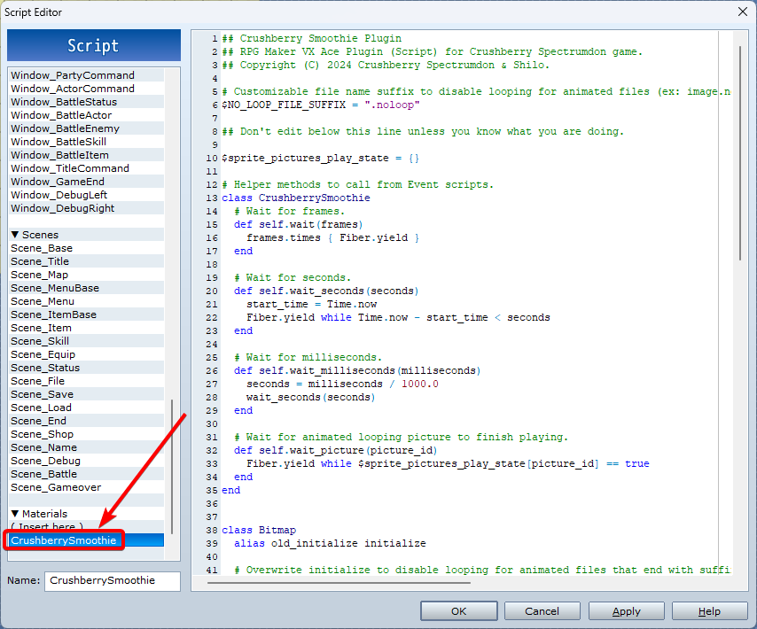

# Crushberry-Smoothie-Plugin

RPG Maker VX Ace Plugin (Script) for Crushberry Spectrumdon game.

## Table Of Contents

-   [Dependencies](#dependencies)
-   [Installation](#installation)
-   [Features](#features)
    -   [Fixes](#fixes)
    -   [Event script helpers](#event-script-helpers)

## Dependencies

[mkxp-z](https://github.com/mkxp-z/mkxp-z) - Open-source cross-platform player

## Installation

1. Open [CrushberrySmoothie.rb](<[CrushberrySmoothie.rb?raw=1](https://raw.githubusercontent.com/Shilo/Crushberry-Smoothie-Plugin/main/CrushberrySmoothie.rb)>) file.
2. Copy all `code` contents.
3. In `RPG Maker VX Ace`, open `Tools > Script Editor (F11)`.
4. Scroll down to `Materials` section.
5. `Right click > Insert` new script named `CrushberrySmoothie`.
6. `Paste` all `code` into blank `script` area.

## Features

### Fixes

-   Animated pictures (GIFs) can be non-loopable with filename suffix: `.noloop.gif`
-   Animated pictures will restart to first frame when picture is changed.

### Event script helpers

-   `CrushberrySmoothie.wait(frame: integer)` - Wait in frames.
-   `CrushberrySmoothie.wait_seconds(seconds: float)` - Wait for time in seconds.
-   `CrushberrySmoothie.wait_milliseconds(milliseconds: integer)` - Wait for time in milliseconds.
-   `CrushberrySmoothie.wait_picture(picture_id: integer)` - Wait for animated non-looping picture to finish.
